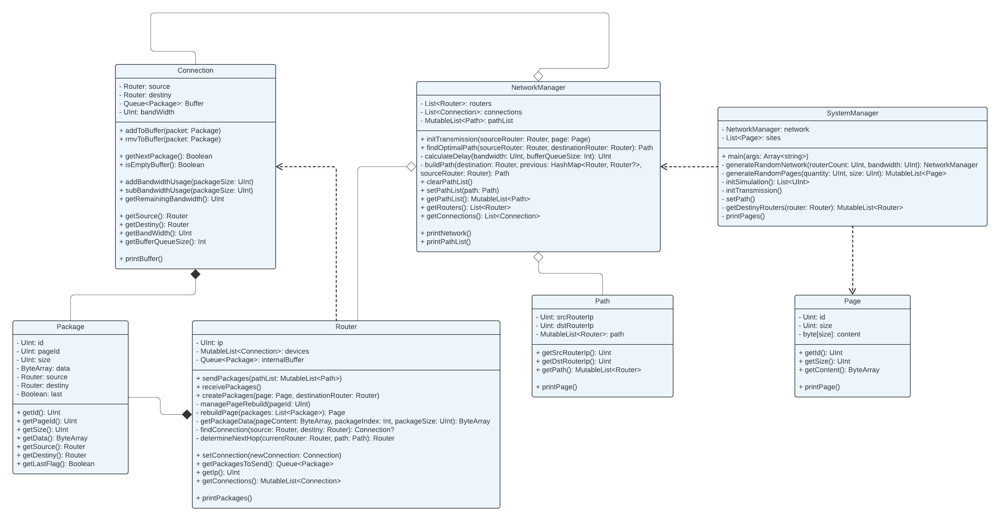

# Simulation of Packet Forwarding Between Routers in a Network Using Dijkstra's Algorithm to find the Shortest Path.

## Date - 2023

## Authors

- **Robledo, Valentín**
- **Bottini, Franco**
 
Github users: valentinrb1, francobottini99

## Abstract

In this project, the simulation of packet sending between routers in a network was carried out. In turn, Dijkstra's algorithm was used to find the shortest path between a source router and a destination router taking into account the bandwidth of the connections.

The project was carried out in Kotlin language applying the object-oriented programming paradigm.

## How to clone this repository?
You can clone this repository to any directory you want using the following command:

```console
git clone https://github.com/valentinrb1/packet-routing-simulation-dijkstra.git
```

> [!NOTE]
> To run the program you need jdk 20.

## How to use?

Go to the main directory of the project and use the following command

```console
./gradlew run
```

It will ask us to enter some parameters for the simulation

```console
Number of routers and pages
```

```console
Page size
```

```console
Bandwidth
```

```console
Number of cycles
```

Once the parameters have been entered, the simulation starts.

### Example

We will see an example for 3 routers, 3 initial pages with a size of 512, a connection bandwidth of 256 and 12 simulation cycles.

Generated connections:

```console
Router [1] Connections: [1 -> 2, 3 -> 1, 1 -> 3, 2 -> 1]
Router [2] Connections: [1 -> 2, 2 -> 3, 2 -> 1, 3 -> 2]
Router [3] Connections: [2 -> 3, 3 -> 1, 1 -> 3, 3 -> 2]
```

Ciclo 1, sending packets:

```console
--- Cicle 1 - Task: SEND_STORE ---
Router [1] - Packet sent ID[1] from router [1] to router [3] | with destiny router [3]
Router [2] - Packet sent ID[1] from router [2] to router [3] | with destiny router [3]
Router [3] - Packet sent ID[1] from router [3] to router [2] | with destiny router [2]
```

Ciclo 2, receiving packets:

```console
--- Cicle 2 - Task: RECEPTION ---
Router [1] - Empty buffer.
Router [1] - Empty buffer.
Router [2] - Empty buffer.
Router [2] - Packet stored ID[1] from router [3] with destiny router [2]
Router [2] - Reconstruct Page [1] Size [45]
Router [3] - Packet stored ID[1] from router [2] with destiny router [3]
Router [3] - Reconstruct Page [3] Size [47]
Router [3] - Packet stored ID[1] from router [1] with destiny router [3]
```

We can see that page [1] was generated with a size [45] therefore it was fragmented into a single packet and the same was rebuilt in the next cycle.

## Diagram Class



## How it works

The simulation works as follows.

### Network generation

The initial phase of the process involves the generation of a graph that will act as the structural representation of the network. To ensure essential properties, the condition is imposed that the graph is connected, meaning that there is at least one path between any pair of nodes in the network. This design approach facilitates the consistency of the simulation.

Each node in the graph denotes a router in the network topology. In this context, the edges of the graph act as the connections between routers. The assignment of weights to these edges reflects the bandwidth associated with each connection.

In addition, pages are initially generated as many routers as the system has. The weight of the pages is set randomly between 1 and the value entered as a parameter.

### Initializing the transmission

Once the network and the initial pages have been generated, we can start with the simulation. For each router in the network, another random destination router and a random page are taken to send. The router takes the page and divides it into packets that it stores in an internal buffer.

Then, the random paths are generated from each router to each destination. These shortest paths are stored in a list in the network where each router can consult it when making a transmission.

### First cycle - Sending packets

In the first cycle, each router will take a packet to send and will place it in the connection buffer. If there are no packets, the router will simply wait for the next sending cycle and will check again if it has any packets to send.

### Second cycle - Receiving packets

In the next cycle, each router will take a packet from the connection buffer, this is done for each connection that it has. The router checks the packet's destination. If the packet has a destination other than the current router, it will end up in the internal buffer for sending in the next cycle. Otherwise, if the packet's destination is the current router, it is stored in an internal buffer where it waits to have all the packets to rebuild the page. If it has all the packets and rebuilds the page, it is simply discarded in order to simulate sending to a terminal.

### Next cycles

In the next cycles, packets continue to be sent and received, one by one.

To feed the simulation further, every 12 cycles more pages are generated as there are routers in the network and the optimal paths are recalculated. In addition, every 6 cycles the optimal paths are also recalculated based on the network bandwidth.
